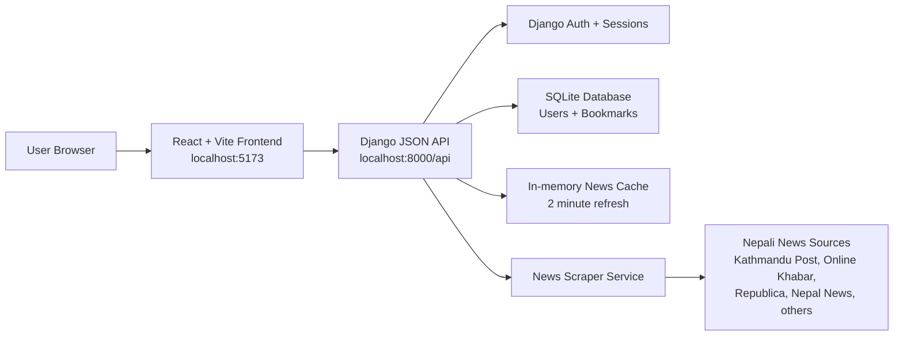

# NewsNepal

NewsNepal is a full-stack Nepali news aggregation app. The Django backend fetches news from Nepali news portals, normalizes the article data, caches the latest batch, and exposes JSON APIs. The React frontend displays paginated news cards with theme switching, bookmarks, authentication, profile, about, and contact pages.

## Tech Stack

| Layer | Technology |
| --- | --- |
| Frontend | React 18, Vite, Chakra UI, React Query, Axios, React Router |
| Backend | Django 5, Python, Requests, BeautifulSoup, Newspaper3k |
| Database | SQLite for local development |
| Auth | Django session authentication with a custom email-based user model |
| Deployment Support | Gunicorn, WhiteNoise, CORS configuration |

## System Architecture



## Project Structure

```text
NewsNepal/
├── README.md
├── NewsNepal-Backend/
│   ├── manage.py
│   ├── requirements.txt
│   ├── news/
│   │   ├── models.py
│   │   ├── scraper.py
│   │   ├── urls.py
│   │   └── views/
│   └── newsnepal/
│       ├── settings.py
│       └── urls.py
└── NewsNepal-Frontend/
    ├── package.json
    ├── vite.config.js
    ├── src/
    │   ├── App.jsx
    │   ├── api/
    │   ├── components/
    │   └── pages/
    └── public/
```

## Local Test Guide

### 1. Start the backend

```bash
cd NewsNepal-Backend
python -m venv venv
source venv/bin/activate
pip install -r requirements.txt
python manage.py migrate
python manage.py runserver
```

Backend URL:

```text
http://127.0.0.1:8000
```

Quick backend checks:

```bash
python manage.py check
```

Open the news API:

```text
http://127.0.0.1:8000/api/news/?page=1&per_page=20
```

Expected result: JSON with `articles`, `total`, `page`, `per_page`, `total_pages`, and `has_next`.

### 2. Start the frontend

Open a second terminal:

```bash
cd NewsNepal-Frontend
npm install
npm run dev
```

Frontend URL:

```text
http://localhost:5173
```

The Vite dev server proxies `/api` requests to the Django backend.

### 3. Test the main app flow

1. Open `http://localhost:5173`.
2. Confirm the first page loads up to 20 news articles.
3. Click `Load More News` and confirm the next 20 articles append.
4. Switch light/dark mode and confirm text remains readable.
5. Open `About` and `Contact` from the header and confirm all text is visible.
6. Sign up with an email and password.
7. Bookmark an article and confirm the bookmark count updates.
8. Open `Bookmarks` and confirm the saved article appears.
9. Remove the bookmark and confirm it disappears.
10. Open `Profile` and test change password if needed.

### 4. Production build check

```bash
cd NewsNepal-Frontend
npm run build
```

Expected result: Vite completes the build and writes files to `dist/`.

## API Endpoints

| Method | Endpoint | Purpose |
| --- | --- | --- |
| GET | `/api/news/?page=1&per_page=20` | Fetch paginated news |
| GET | `/api/bookmarks/` | List user bookmarks |
| POST | `/api/bookmarks/add/` | Add or update a bookmark |
| POST | `/api/bookmarks/remove/` | Remove a bookmark |
| GET | `/api/bookmarks/count/` | Get bookmark count |
| GET | `/api/accounts/status/` | Check auth status |
| POST | `/api/accounts/signup/` | Create account |
| POST | `/api/accounts/login/` | Login |
| POST | `/api/accounts/logout/` | Logout |
| POST | `/api/accounts/change-password/` | Change password |
| POST | `/api/accounts/delete/` | Delete account |

## Notes

- The news endpoint returns 20 articles per page by default.
- The scraper uses parallel source fetching and a short in-memory cache so local loads stay fast.
- Some external news sites may change layout or block requests; fallback extraction keeps the app usable when selectors drift.
- For deployment, move secrets and OAuth values out of `settings.py` into environment variables.
